# 最終レポート チーム 18

## Web ページの概要

部活の紹介と、部室予約システムを提供する Web ページ。

以下、その他の依存リポジトリについてのリンクを示す。

動的サイト フロントエンドソースコード: [https://github.com/calloc134/reserv-frontend-lab](https://github.com/calloc134/reserv-frontend-lab)  
動的サイト バックエンドソースコード: [https://github.com/calloc134/reserv-backend-lab](https://github.com/calloc134/reserv-backend-lab)

## サイトマップ

サイトマップを以下に示す。


## Web ページの外観

### 静的サイト部分

トップページの見た目は以下のとおりである。

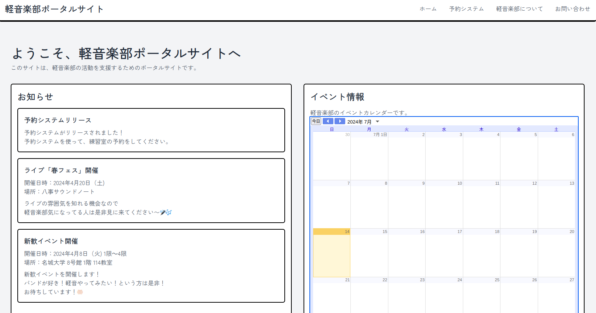


ここで、カレンダーは軽音楽部のイベントについての予定を表示している。

右上は、それぞれ

- ホーム
- 予約システム
- 軽音楽部について
- お問い合わせ
  を示している。

また、当該サイトはグリッドシステムを利用し、レスポンシブ対応を行っている。

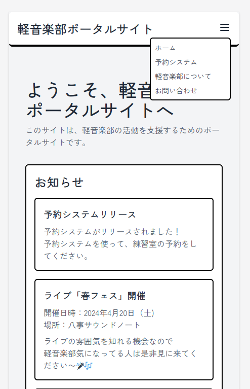


予約システム画面については動的サイトであるため、後述する。

軽音楽部についての画面については以下の通り。

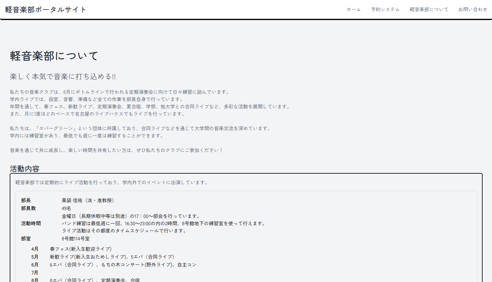

アクセスマップも表示するようになっている。

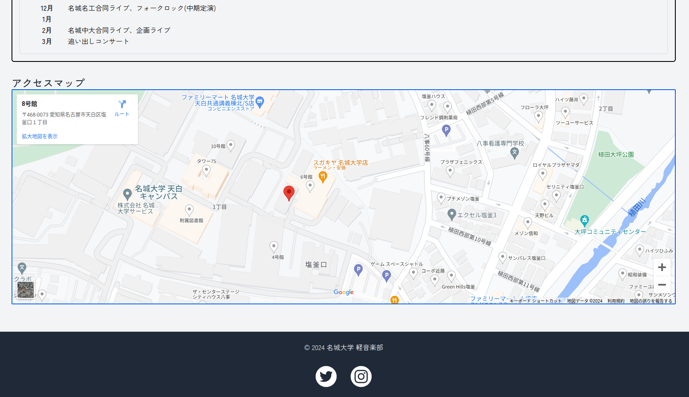

また、スマホ表示は以下の通り。


お問い合わせ画面については以下の通り。

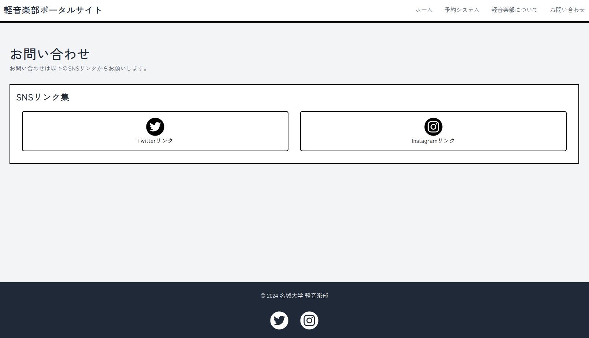

スマホ表示は以下の通り。


### 動的サイト部分

ログインしていない場合、以下のようにログイン画面が表示される。


予約サイトにログインすると、以下のようになる。

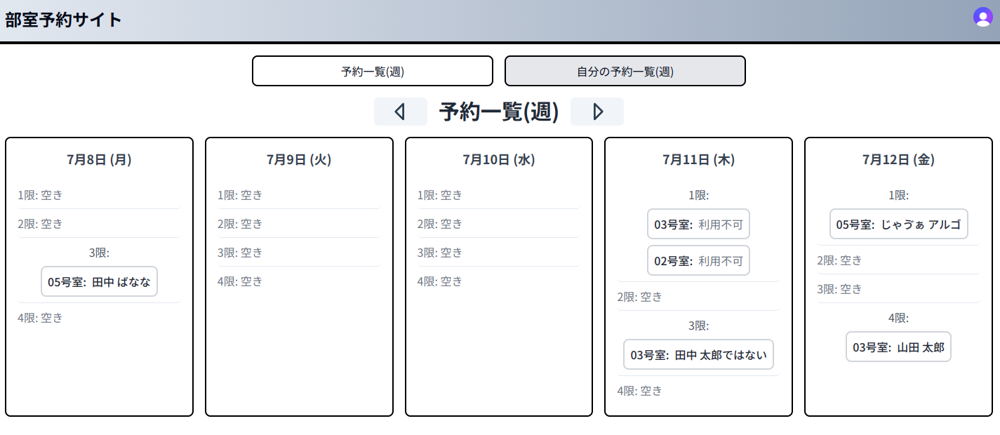

ここで、ログインしているユーザの状態を確認することができる。

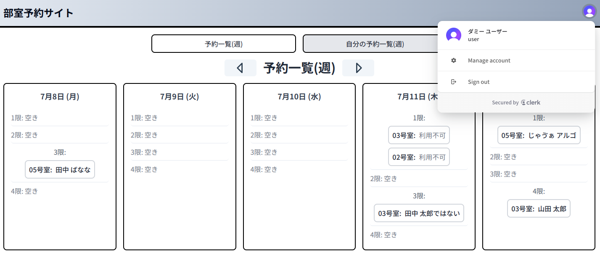

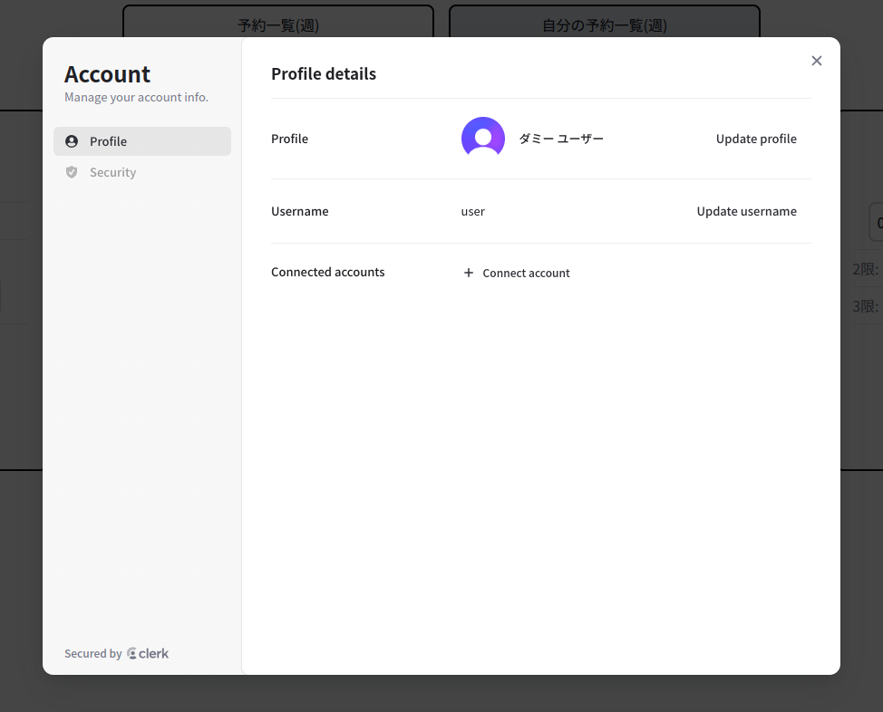

予約一覧画面では、すべてのユーザに対して予約の一覧を表示し、予約を作成することができる。

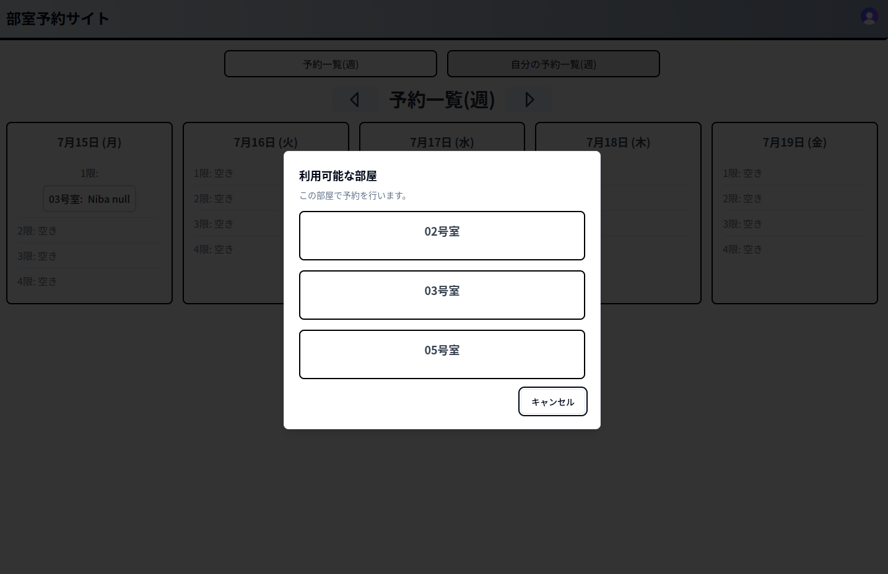


自分の予約一覧画面では、自分の予約の一覧を表示し、予約を取り消すことができる。

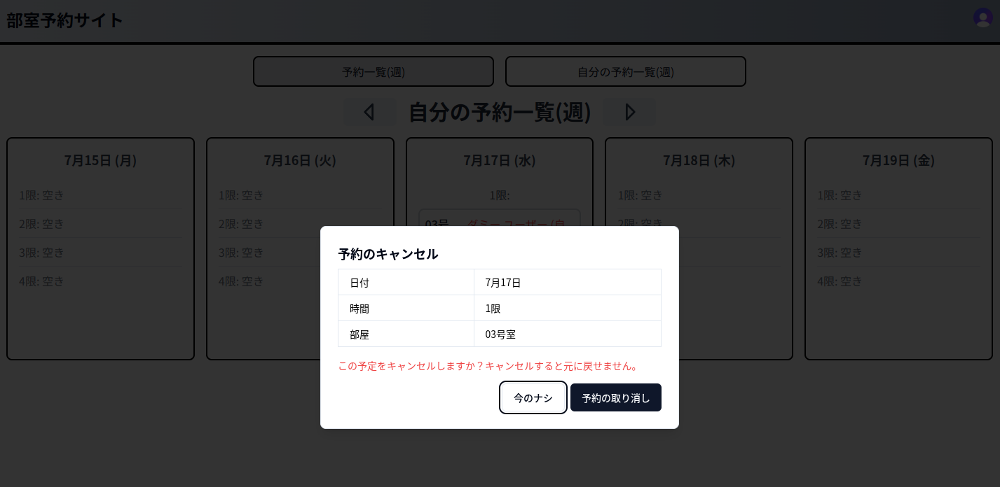

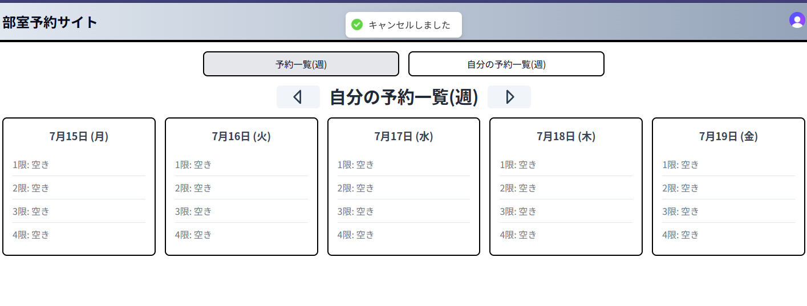

また、右上のユーザアイコンからログアウトすることができる。

なお、予約の作成は過去や当日について行うことができない。

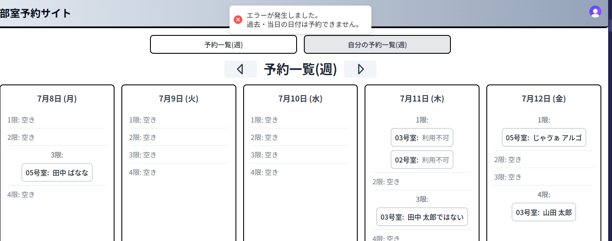

また、一週間以内にすでに予約がある場合も予約を行うことができない。

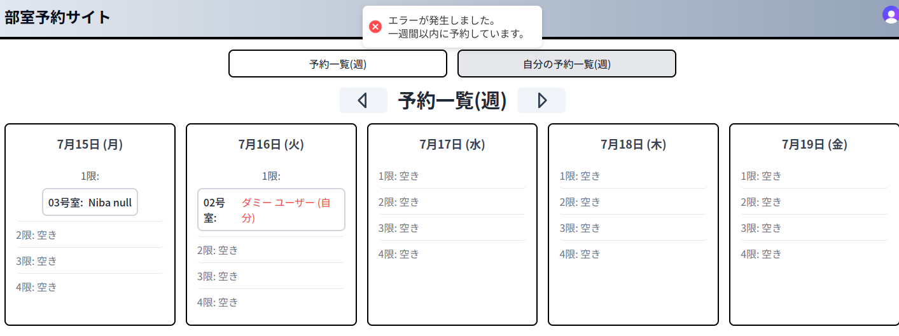

加えて、予約のキャンセルは予約より 3 日前までとなっている。

なお、予約の閲覧では、ボタンによって週の切り替えを行うことができる。


なお、スタイリングには Grid システムを利用し、レスポンシブ対応を行っている。

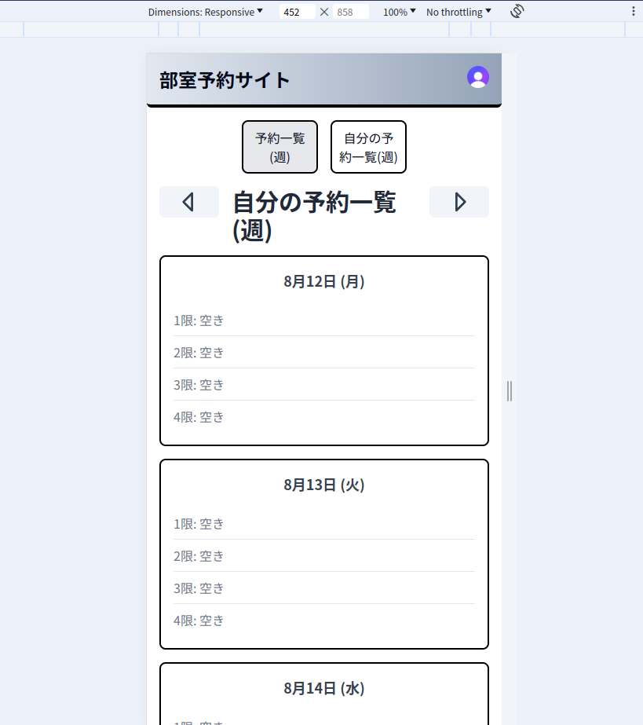
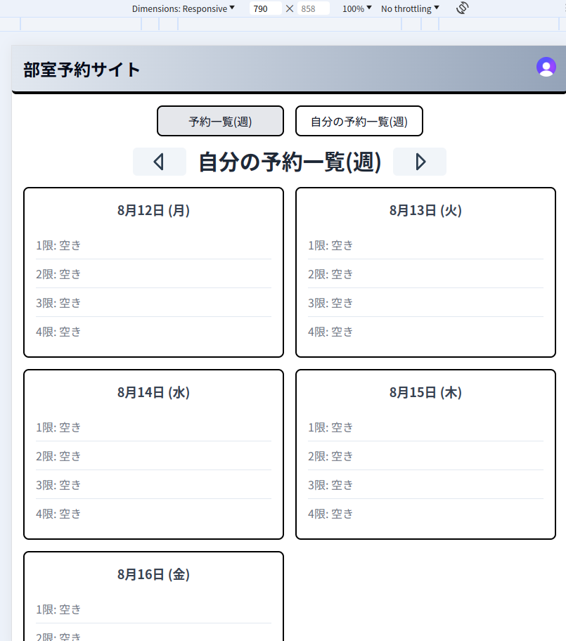

## 作業分担

| 名前      | 作業内容                                                                                                                                                                                                                                                                                                                                                                           |
| --------- | ---------------------------------------------------------------------------------------------------------------------------------------------------------------------------------------------------------------------------------------------------------------------------------------------------------------------------------------------------------------------------------- |
| calloc134 | - 静的サイトの作成(HTML, TailwindCSS) <br> - CD パイプラインの構築(Github Actions) <br> - Netlify へのデプロイ <br> - SQL スキーマ記述(Neon Database) <br> - バックエンドサーバのセットアップ(Cloudflare Workers) <br> - 認証サービスの導入(Clerk) <br> - 予約システムバックエンド構築(Hono) <br> - 予約システムフロントエンド構築(React) <br> - 予約システムデザイン(TailwindCSS) |

## アピールポイント

- 動的な部室予約システムの構築
  - バックエンドでは SQL を記述してデータを永続化しており、またビジネスロジックとして以下の制約を設けている
    - 一週間以内に自分の予約があれば予約できない
    - すでに予約がある場合は予約不可
    - 予約の取り消しは 3 日前まで
      - 技術的な観点として、SQL にインデックスを設けることでクエリの高速化を図った
        - のだが、うまくインデックスが効かずシーケンシャルスキャンになってしまっている。要改善。
  - ログインはアカウント作成だけでなく、Google アカウントでのログインも可能(Clerk の機能)
    - Google アカウント
    - LINE アカウント
    - Discord アカウント
- 開発体験の向上
  - DevContainer を利用した開発環境の構築で、他メンバの環境構築の手間を省くことができた
  - prettier を導入し、フォーマットの統一を図った
  - tailwindcss の導入で、スタイリングの効率化
  - Vite を利用したホットリロードで、開発効率を向上させた

## まとめ

## 静的サイト 実行方法

devcontainer で開発環境を整えてあるため、Github Codespaces から開発を行うことができる。
コンテナにアタッチした後、以下のコマンドを実行することで、Tailwind CSS で CSS のコンパイルをしながら HTML を確認するサーバを立ち上げることができる。

```bash
pnpm tailwindcss -i css/input.css -o css/style.css --watch & pnpm vite
```

## 利用技術

以下、静的サイト部分の技術について記載。

### pnpm

JavaScript/TypeScript におけるパッケージマネージャである。  
npm や yarn と比べて高速であることが特徴である。

### Tailwind CSS

CSS フレームワークであり、クラスベースでスタイリングを行うことができる。  
CSS の記述を減らすことができるため、効率的にスタイリングを行うことができるが、style 属性でのスタイリングのような記述となるため、適切な利用が推奨される。

### Vite

開発環境を提供するビルドツールであり、フロントエンド開発で頻繁に利用される。  
今回はホットリロード機能を利用するために採用した。  
これにより、ファイルの変更を検知してコンテンツを再読み込みするだけでなく、ブラウザに更新通知を送信し、接続しているクライアントに自動的に再読み込みを行わせることができる。

以下、動的サイト部分の技術について記載。

### Netlify

静的サイトのホスティングを行うために採用した。

### Github Actions

CI/CD ツール。  
html がプッシュされた際、Netlify にデプロイするために採用している。  
動的サイトのリポジトリの内容をビルドして同梱させる処理も行っている。
これにより、main ブランチに push された際や PR をマージした際、自動で Netlify にデプロイされ、反映させることができる。

### Clerk

認証サービス。IDaaS として機能する。

### React

予約管理システムのフロントエンドを構築するために採用した。

### Tanstack Router

予約管理システムのルーティング部分を構築するために採用した。

### Tanstack Query

データ取得を行うためのライブラリ。

### react-hot-toast

通知を表示するためのライブラリ。

### shadcn/ui

UI コンポーネントを提供するライブラリ。

### Hono

TypeScript で動作するサーバサイドフレームワーク。  
予約管理システムのバックエンドを構築するために採用した。

### Cloudflare Workers

Cloudflare の提供するサーバレスプラットフォーム。  
予約管理システムのバックエンドをホスティングするために採用した。

### Neon Database

サーバレスデータベースを提供する SaaS。
PostgreSQL 互換の SQL データベースを提供する。

### SafeQL

SQL クエリを発行し、TypeScript の型とマップするライブラリ。

### DevContainer

開発環境をコンテナ化するための機能。  
今回はこれを利用して開発環境を構築した。
